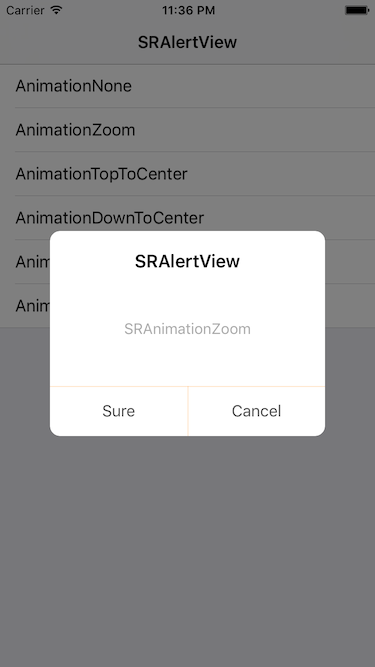

# SRAlertView
**A custom alert view which has animation while showing.**




### Usage

````objc
// BLOCK
// Only one button
[SRAlertView sr_showAlertViewWithTitle:@"SRAlertView"       
									 message:@"SRAnimationNone"
                          leftBtnTitle:@"Sure"
                         rightBtnTitle:nil
                        animationStyle:AlertViewAnimationNone
                         clickBtnBlock:^(AlertViewBtnType btnType) {
                             NSLog(@"%zd", btnType);
                         }];

// Can have at most two button
[SRAlertView sr_showAlertViewWithTitle:@"SRAlertView"
                               message:@"SRAnimationZoom"
                          leftBtnTitle:@"Sure"
                         rightBtnTitle:@"Cancel"
                        animationStyle:AlertViewAnimationZoom
                         clickBtnBlock:^(AlertViewBtnType btnType) {
                             NSLog(@"%zd", btnType);
                         }];
````

````objc
// DELEGATE
[SRAlertView sr_showAlertViewWithTitle:@"SRAlertView"
                               message:@"SRAnimationDownToCenterSpring"
                          leftBtnTitle:@"Sure"
                         rightBtnTitle:@"Cancel"
                        animationStyle:AlertViewAnimationDownToCenterSpring
                              delegate:self];
                                      
- (void)alertViewDidClickBtn:(AlertViewBtnType)btnType {
    
    NSLog(@"%zd", btnType);
}
````

**If you have any question, please issue or contact me.**

**If you like it, please star me, thanks a lot.**

**Have Fun.**

